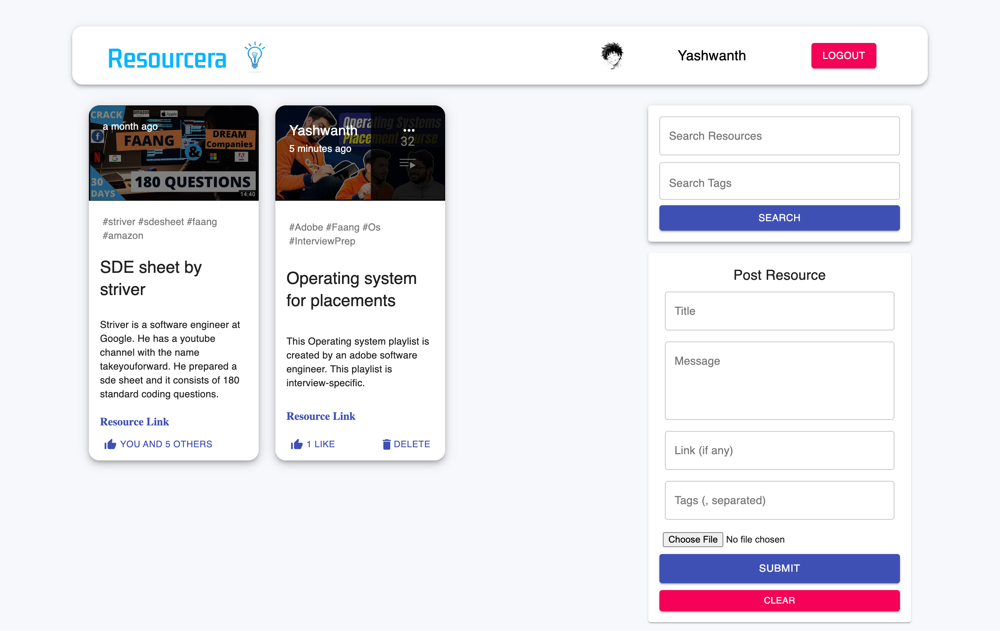
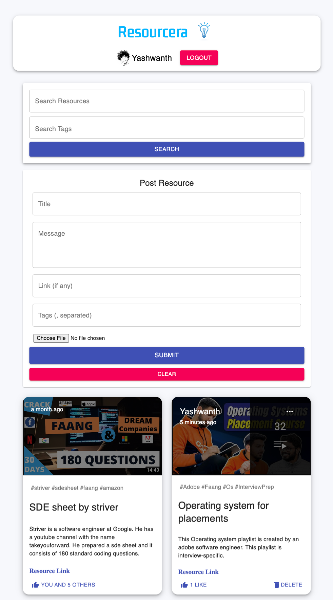
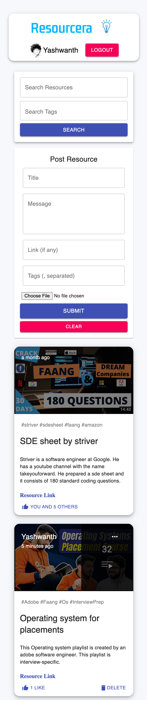
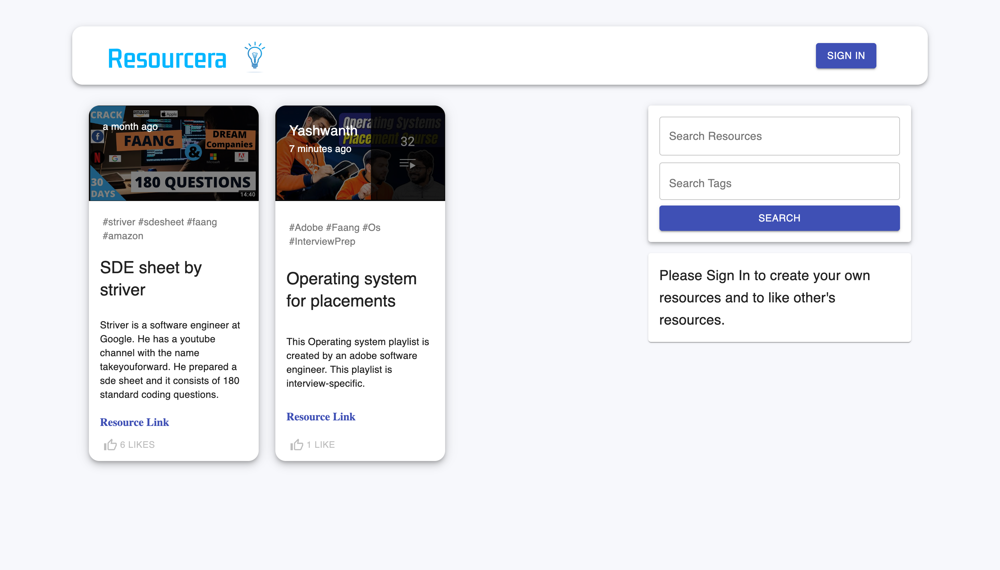
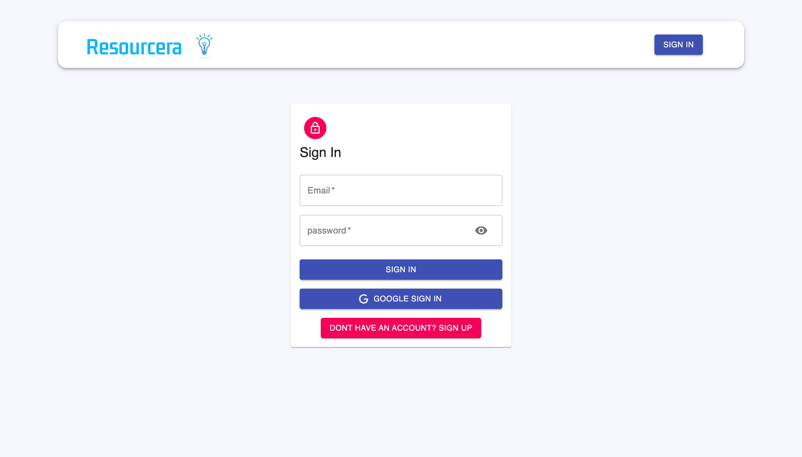
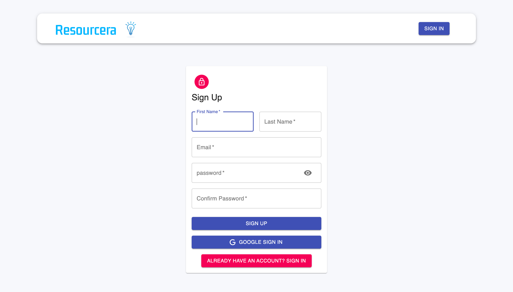

# Resourcera
Resourcera is a website where users can create, update, delete their resources, view resources posted by others, and like them. Resourcera is a responsive website that works on mobiles, tablets,  laptops, etc. A resource consists of a title, message, link, tags, and thumbnail. Users can search the resources with the help of keywords and tags. Users can log in or create their accounts manually by entering their credentials or can use google login for quick login.

## Screenshots

### Desktop View

### Ipad View

### Mobile View

### Before Login

### Sign In Page

### Sign Up Page

## Features

- Create a resource
- Read a resource
- Update a resource
- Like a resource
- Delete a resource
- Search resources
- Google Authentication
- Responsive

## Frontend

- #### Frontend Library : [React JS](https://reactjs.org/)
- #### State management : [Redux](https://redux.js.org/)

## Backend
- #### Backend Framework: [Express Js](http://expressjs.com/en/starter/installing.html)
- #### Database: [Mongo DB](https://www.mongodb.com/cloud/atlas/lp/try2-in?utm_source=bing&utm_campaign=mdb_bs_apac_india_search_core_brand_atlas_desktop&utm_term=mongodb&utm_medium=cpc_paid_search&utm_ad=e&utm_ad_campaign_id=415204524&adgroup=1207264237113792&msclkid=b8304cb256c219643a612e2caa195109)
